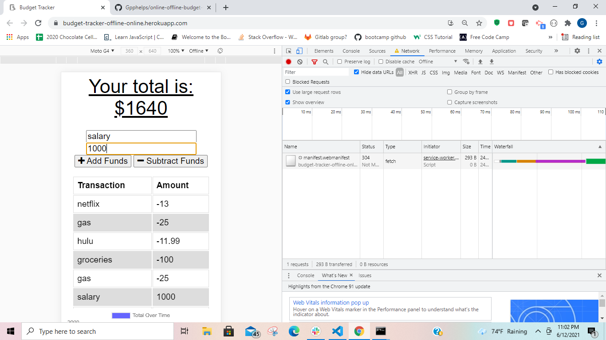
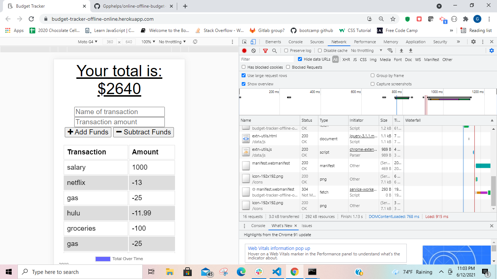

# online-offline-budget-tracker

## Description
For the modern person who needs to keep track of their spending even when they do not have access to the internet the online-offline-budget-tracker is the perfect solution. This application makes use of a service-worker to cache the applications transactions and files and store them to an indexedDB when offline and then post them to the applications database when internet access is restored.

## Usage
To use the application go to https://budget-tracker-offline-online.herokuapp.com/ and start balancing your budget by adding and subtracting funds. Dont worry if you lose internet access the app will store your data so you dont have to worry about anything!




## Installation
If you would like a local version of this application run this command in bash:
```bash
git clone https://github.com/Gpphelps/online-offline-budget-tracker
```
Then at the root level of the created repo open an integrated terminal and run:
```bash
npm i
```
Make sure you have a connection to a mongooseDB running when you first open by running this command in a bash window:
```bash
mongod
```
Finally run in the repo's integrated terminal:
```bash
node server.js
```
You now have a locally hosted version of the budget-tracker with all of its capabilities!

## Features 
This application features the use of mongoose-atlasDB to store the transaction data from any user from anywhere. It also uses a service-worker.js to store the users transaction when the application loses access to the internet. 

## Contributing
If you would like to contribute in any way to this project please feel free to post an issue to the Github repository and I will address it as soon as possible.

## license
MIT

## Repository
https://github.com/Gpphelps/online-offline-budget-tracker

## Deployed Application
https://budget-tracker-offline-online.herokuapp.com/


